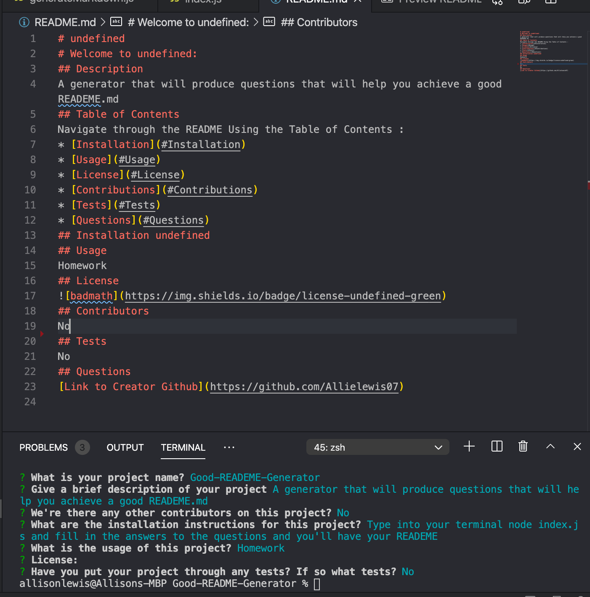

# Welcome to Good-READEME-Generator: 
## Description
A generator that will produce questions with npm that will help you achieve a good READEME.md all you have to do is answer the following questions given.
## Table of Contents
Navigate through the README Using the Table of Contents : 
* [Installation](#Installation)
* [Usage](#Usage)
* [License](#License)
* [Contributions](#Contributions)
* [Tests](#Tests)
* [Questions](#Questions)
## Installation 
Just use your terminal and type "node index.js" That will start the questions in your terminal. Fill out your answers and once finished you will have a proper READEME.md!
## Usage
Homework
## License

## Contributors
No
## Tests
No
## Questions
[Link to Creator Github](https://github.com/Allielewis07)

